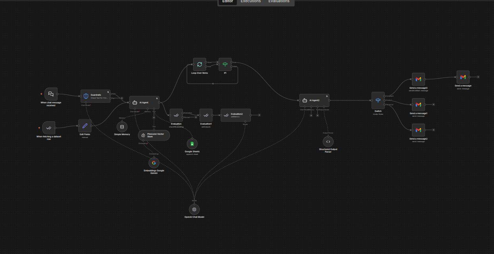

# AI Operations Assistant - n8n

AI-powered customer support automation workflow built with n8n.

## Features
- AI customer support intake
- RAG with Pinecone
- Guardrails
- Department routing
- Gmail automation
- Google Sheets logging
- Structured classification
- Human escalation flow
- Evaluations

## Stack
- n8n
- OpenAI
- Pinecone
- Google Sheets
- Gmail

## Import
1. Download the workflow JSON
2. Import into n8n
3. Add your credentials
4. Configure your Google Sheets and Gmail
5. Activate workflow
## Workflow Overview

